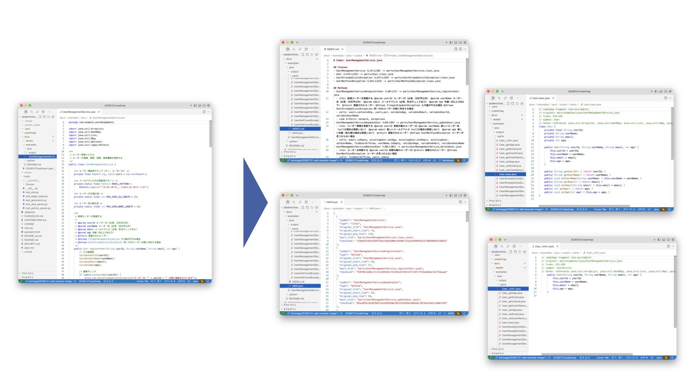

# code2map

[English](./README.md) | [日本語](./README_ja.md)

[](https://elvez.co.jp/)
[](https://elvez.co.jp/ixv/)
[](https://opensource.org/licenses/MIT)
[](https://www.python.org/)
[](https://github.com/elvezjp/code2map/stargazers)

A Python library and CLI that indexes source structure and assembles context-aware inputs for AI analysis and review. Existing symbol extraction remains available.



## Context-aware partitioning (0.4.0 development)

Development version 0.4.0 on branch `codex/20260905-context-partitioning` adds a reusable engine that indexes whole source files before assembling budgeted context packets. It supports PL/SQL, Python, and Java, including directories with mixed languages. The existing `build` command and its output format remain available.

Run at the repository root after [setup](#setup).

```bash
uv run code2map index examples --output output/index.json
uv run code2map tree output/index.json --depth 3
uv run code2map pack output/index.json --output output/pack.json --budget-bytes 16000
uv run code2map check output/index.json --pack output/pack.json
```

Each packet carries an exact target range, enclosing headers, lexical dependency candidates, and exception-region references. Targets reconstruct every indexed source exactly once; supporting context is separate. No source execution, LLM, or database connection is needed.

The CLI budget counts the **entire payload in UTF-8 bytes**, not model tokens. A custom model counter can be supplied through the Python API. Indivisible oversized regions and parse failures are reported explicitly. A `ready` packet fits the budget; it does not imply complete semantic analysis.

See the [context engine guide](docs/context/README.md) for the API, extension contracts, limitations, and migration from 0.3.0.

## Use Cases

- **AI Code Review**: Split large files at structural boundaries to support focused reviews
- **Code Structure Visualization**: Output class/method lists and dependencies as an index
- **Line Number Mapping**: Reliably map AI feedback to original file line numbers
- **Documentation Assistance**: Support design document creation with code structure insights

## Background

This tool is a small utility born from the development of **IXV**, an AI development ecosystem designed for Japanese engineering teams.

IXV delivers a methodology and OSS that put AI to practical use in real development workflows. This repository publishes a portion of that work.

## `build` Features

- **Semantic Splitting**: Split code by class, method, and function units (for review, not build)
- **Markdown Index Generation**: Auto-generate INDEX.md with role descriptions, call relationships, and side effects
- **Line Number Mapping**: Provide correspondence between parts and original file in MAP.json (machine-readable)
- **Python & Java Support**: Structural symbol extraction via AST (Python) and tree-sitter CST (Java, supports Java 8+ syntax)
- **Dry Run**: Preview generation plan before actual output

## Documentation

- [Context engine guide](docs/context/README.md) - Migration, all CLI options, exit codes, Python API
- [Architecture](docs/context/architecture.md) - Determinism and context assembly
- [Data contracts](docs/context/contracts.md) - Schemas and extension interfaces
- [Supported behavior and limitations](docs/context/limitations.md) - Implemented features and remaining work
- [Validation record](docs/context/validation.md) - Tests and verified environments

- [CHANGELOG.md](CHANGELOG.md) - Version history
- [CONTRIBUTING.md](CONTRIBUTING.md) - Contribution guidelines
- [SECURITY.md](SECURITY.md) - Security policy
- [spec_en.md](spec_en.md) - Existing `build` specification
- [examples/](examples/) - PL/SQL, Python and Java context-engine samples
- [docs/examples/](docs/examples/) - `build` I/O samples from previous releases

## Setup

### Requirements

- Python 3.11 or higher
- [uv](https://docs.astral.sh/uv/) (recommended package manager)

### Installation

```bash
# Clone the repository
git clone https://github.com/elvezjp/code2map.git
cd code2map

# Select the unreleased 0.4.0 development branch
git switch codex/20260905-context-partitioning

# Install dependencies with uv (virtual environment created automatically)
uv sync --locked --all-extras

# Verify installation
uv run code2map --version
uv run code2map --help
```

## `build` Usage

### Basic Execution

```bash
# Analyze a Python file
uv run code2map build your_code.py --out ./output

# Analyze a Java file
uv run code2map build YourCode.java --out ./output
```

### Check Output

```bash
# View the index
cat output/INDEX.md

# View the split code parts
ls output/parts/

# View the line number mapping
cat output/MAP.json
```

### Dry Run (Preview)

```bash
# Preview the plan without generating files
uv run code2map build your_code.py --dry-run
```

## `build` Options

| Option | Default | Description |
|--------|---------|-------------|
| `--out <DIR>` | `./code2map-out` | Output directory |
| `--lang {java,python}` | Auto-detect | Explicitly specify language |
| `--id-prefix <PREFIX>` | `CD` | Symbol ID prefix (CD1, CD2, ...) |
| `--verbose` | false | Output detailed logs |
| `--dry-run` | false | Preview only, no file generation |

For details, see `uv run code2map build --help`.

## `build` Output Examples

### INDEX.md

This is a schematic formatting example. See [previous-release samples](docs/examples/) for generated output.

```markdown
# Index: user_management.py

## Classes
- [CD1] UserManager (L10–L150) → parts/UserManager.class.py

## Methods
- [CD2] UserManager#create_user (L45–L80) → parts/UserManager_create_user.py
  - role: Create a new user
  - calls: validate_email, hash_password
  - side effects: DB operations
```

### MAP.json

```json
[
  {
    "id": "CD1",
    "symbol": "UserManager",
    "type": "class",
    "original_file": "user_management.py",
    "original_start_line": 10,
    "original_end_line": 150,
    "part_file": "parts/UserManager.class.py",
    "checksum": "a1b2c3d4..."
  }
]
```

## Directory Structure

```text
code2map/
├── code2map/              # Main package
│   ├── cli.py             # CLI entry point
│   ├── context/           # Source index, context packing and validation
│   │   └── adapters/      # PL/SQL, Python and Java adapters
│   ├── generators/        # Output generation modules
│   │   ├── index_generator.py   # INDEX.md generation
│   │   ├── map_generator.py     # MAP.json generation
│   │   └── parts_generator.py   # parts/ generation
│   ├── models/            # Data models
│   │   └── symbol.py      # Symbol information class
│   ├── parsers/           # Language parsers
│   │   ├── base_parser.py     # Base class
│   │   ├── java_parser.py     # Java parser
│   │   └── python_parser.py   # Python parser
│   └── utils/             # Utilities
│       ├── file_utils.py  # File operations
│       └── logger.py      # Log configuration
├── examples/              # Synthetic context-engine inputs
├── tests/                 # Test code
│   └── fixtures/          # Test fixtures
├── docs/                  # Documentation
│   ├── context/           # Context-engine docs (English/Japanese)
│   ├── assets/            # Images and assets
│   ├── examples/          # Usage examples and sample I/O
│   └── tests/             # Test plans and results
├── CHANGELOG.md           # Change history
├── CONTRIBUTING.md        # Contribution guide
├── README.md              # This file (English)
├── README_ja.md           # Japanese README
├── SECURITY.md            # Security policy
├── spec.md                # build specification (Japanese)
├── spec_en.md             # build specification (English)
└── pyproject.toml         # Project configuration
```

## Version Management

Only the latest code is kept at the repository root. Versions are managed with git tags.

- The `main` branch accumulates changes for the next version under the `## [Unreleased]` heading in [CHANGELOG.md](CHANGELOG.md)
- On release, the version in `pyproject.toml` is confirmed, the heading date is finalized, and a `vX.Y.Z` tag is created

### Using Old Versions

Old versions (v0.1.1–v0.2.0) were previously kept as snapshots under a `versions/` directory. That layout is preserved in the `v0.2.1` tag:

```bash
git checkout v0.2.1
# Old versions are under versions/
```

**Note**: The `v0.2.1` tag serves as the archive reference point for the old layout. Do not delete or move it.

## Limitations

- `build` extracts symbols from one Python/Java file. Fragments overlap and have no enforced input budget.
- `index` accepts PL/SQL, Python and Java files/directories; `pack` partitions along source structure. Indivisible regions can exceed the budget.
- Calls and variable references are static candidates. Complete data flow and runtime bindings are not resolved.

See the [build specification](spec_en.md) and [context-engine limitations](docs/context/limitations.md).

## Security

For security details, see [SECURITY.md](SECURITY.md).

- Be cautious when processing files from untrusted sources
- Output files contain the original source code

## Contributing

Contributions are welcome. For details, see [CONTRIBUTING.md](CONTRIBUTING.md).

- Bug reports & feature requests: [Issues](https://github.com/elvezjp/code2map/issues)
- Pull requests: Branch naming convention `{username}/{date}-{description}`

## Changelog

For details, see [CHANGELOG.md](CHANGELOG.md).

## License

MIT License - For details, see [LICENSE](LICENSE).

## Contact

- **Issues**: [GitHub Issues](https://github.com/elvezjp/code2map/issues)
- **Email**: info@elvez.co.jp
- **Company**: [Elvez Inc.](https://elvez.co.jp/)
